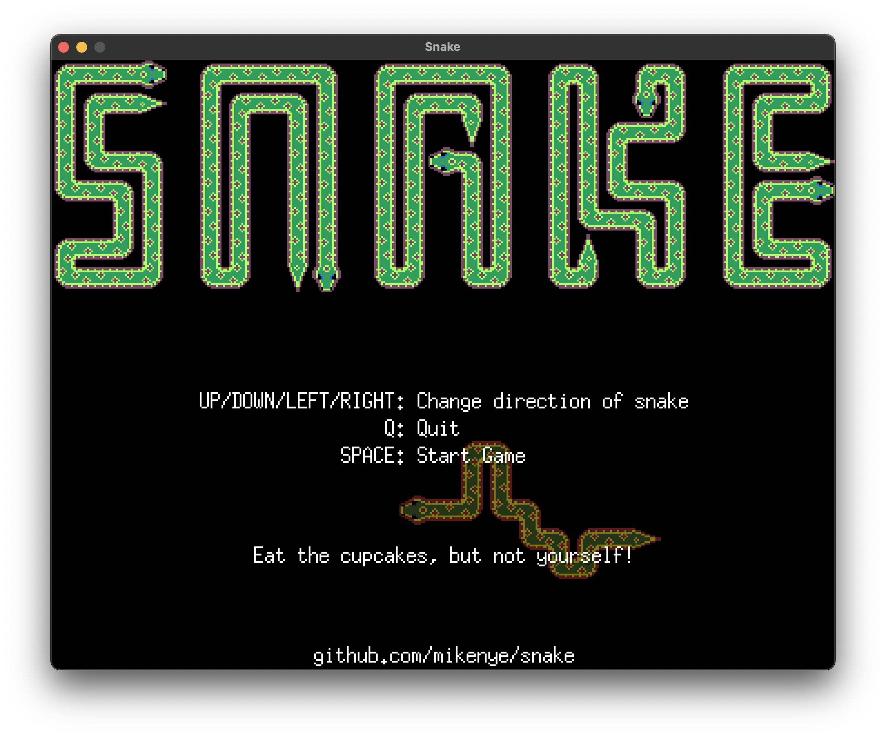
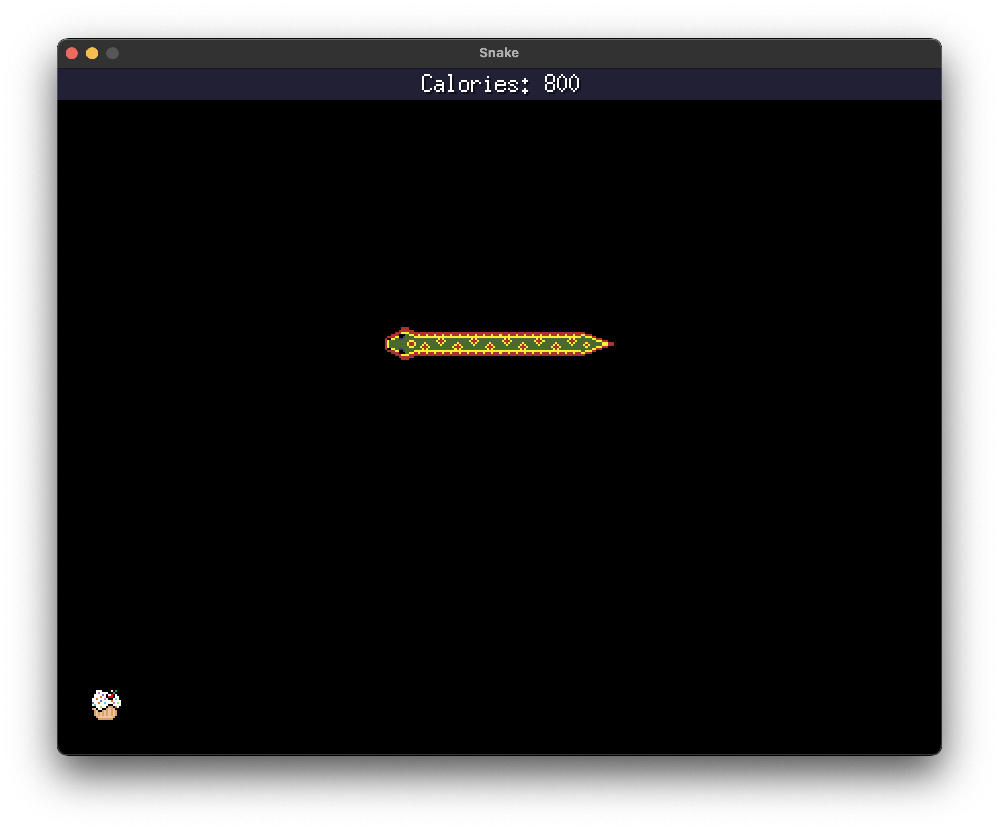
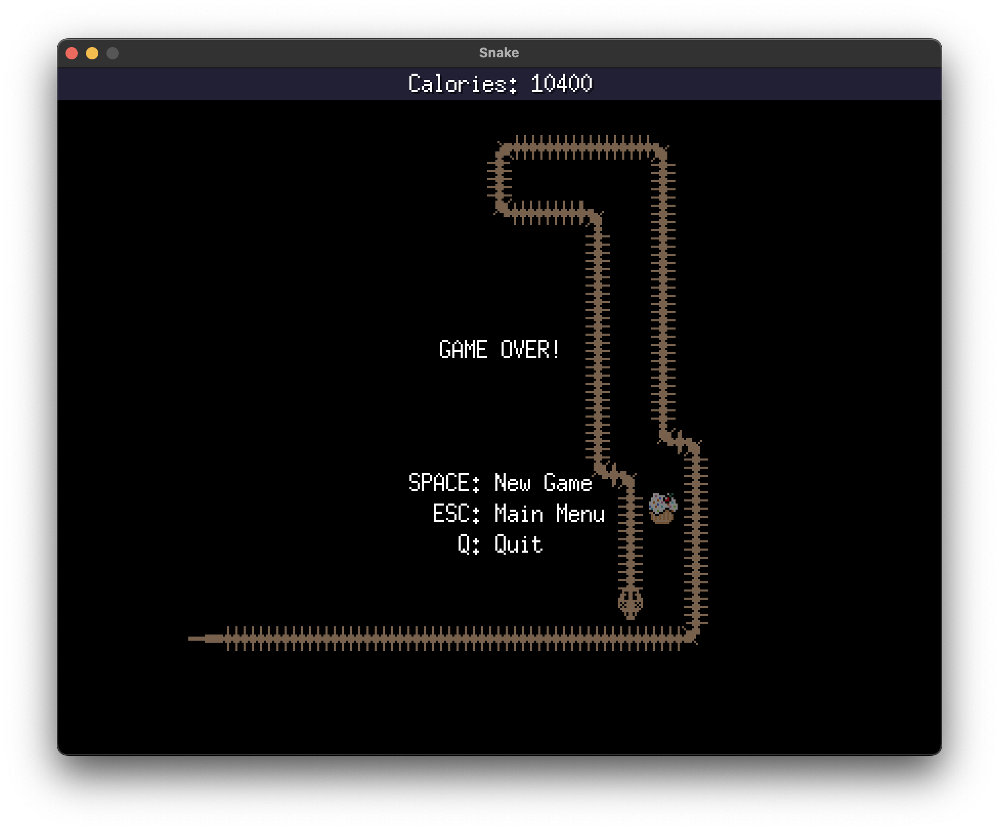

# Snake

Classic "Snake" game, implemented in [Go](https://go.dev) using the fantastic [Ebitengine](https://ebitengine.org).

## Instructions

* Arrow keys set the snake's direction (Nokia style).
* Eat the cupcakes.
* Don't eat yourself.
* If the snake goes off the edge of the screen, it will wrap around to the opposite edge.

## Screenshots

## Background

I recently watched [Code-It-Yourself! Snake! - Programming from Scratch (Quick and Simple C++)](https://www.youtube.com/watch?v=e8lYLYlrGLg) by One Lone Coder, and thought this would be cool to implement in Go using Ebitengine.

I'm trying to get better at Golang and Ebitengine so this was a fun little exercise.

## Requirements

* Golang version 1.22

## Building

You can build by:

* Cloning the repo
* Run `go mod tidy` from the root of the repo to download Ebitengine and other required modules.
* Run `go run main.go` to run the app.
* Run `go build -o <path_to_binary> to build an executable binary.
